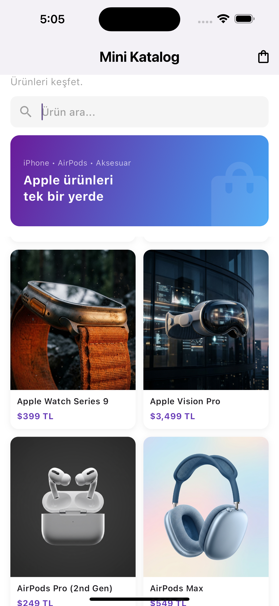
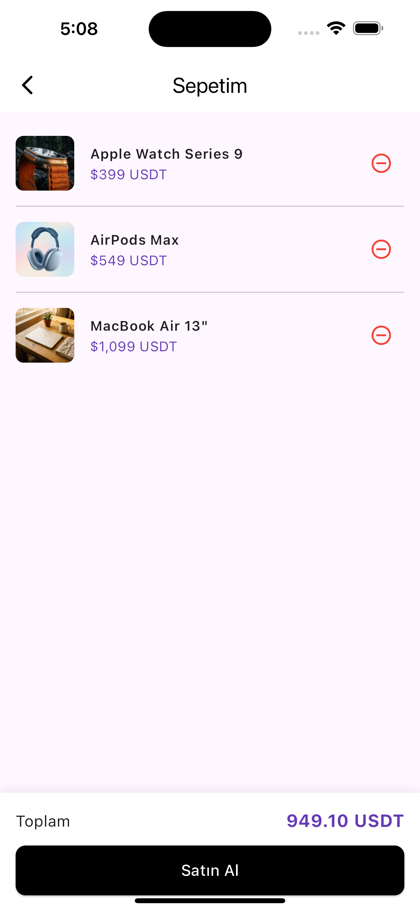

# Mini Katalog

Ürünleri listeleyip detaylarını görüntüleyebileceğiniz, sepete ekleyebileceğiniz basit bir Flutter katalog uygulaması.

## Özellikler

- Ürün listesi (GridView)
- Ürün detay sayfası
- Sepete ekleme ve sepet yönetimi
- Ürün arama / filtreleme
- API'den dinamik veri çekme

## Kullanılan Flutter Sürümü

Flutter 3.22.1

## Kurulum ve Çalıştırma

1. Projeyi klonlayın:
   ```bash
   git clone <repo-url>
   cd mini_katalog
   ```

2. Bağımlılıkları yükleyin:
   ```bash
   flutter pub get
   ```

3. Uygulamayı çalıştırın:
   ```bash
   flutter run
   ```

## Ekran Görüntüleri

| Ana Sayfa | Ürün Detay |
|-----------|------------|
|  |  |

| Sepet (Dolu) | Sepet (Boş) |
|--------------|-------------|
|  |  |

## Kullanılan Teknolojiler

- Flutter 3.22.1
- Dart
- http paketi (API istekleri için)
